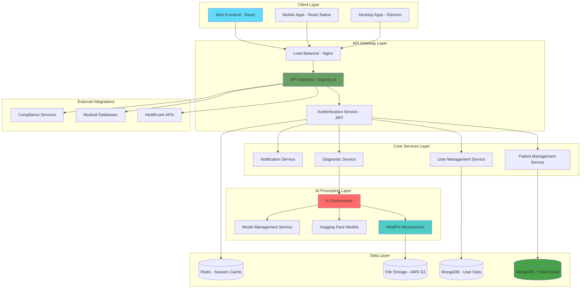

# 🏗️ IntelliCare System Architecture

<div align="center">
  
  
  
</div>

---

## 🎯 **Architecture Overview**

IntelliCare employs a **modern, scalable microservices architecture** designed specifically for healthcare applications, ensuring security, reliability, and performance at enterprise scale.

## 📊 **System Architecture Diagram**



---

## 🏛️ **Architecture Principles**

### 🎯 **Design Philosophy**
- **Security First** - Every component designed with healthcare security in mind
- **Scalability by Design** - Horizontal scaling capabilities from day one
- **Microservices Architecture** - Independent, loosely coupled services
- **API-First Approach** - All functionality exposed through well-defined APIs
- **Cloud-Native** - Built for modern cloud infrastructure

### 🔒 **Security Principles**
- **Zero Trust Architecture** - Verify every request, trust nothing by default
- **Defense in Depth** - Multiple security layers throughout the system
- **Least Privilege Access** - Minimal required permissions for each component
- **Data Encryption** - Encryption at rest and in transit
- **Audit Trail** - Comprehensive logging of all system activities

---

## 🖥️ **Frontend Architecture**

### 📱 **Client Applications**

#### **Web Application (React)**
- **Framework:** React 18+ with TypeScript
- **State Management:** Context API with custom hooks
- **Styling:** Tailwind CSS for responsive design
- **Routing:** React Router for single-page application navigation
- **Authentication:** JWT token-based authentication
- **API Communication:** Axios with interceptors for error handling

#### **Progressive Web App (PWA)**
- **Service Workers** - Offline functionality and caching
- **Responsive Design** - Mobile-first approach
- **Push Notifications** - Real-time diagnostic alerts
- **Local Storage** - Secure client-side data persistence

### 🎨 **UI/UX Architecture**
```
src/
├── components/           # Reusable UI components
│   ├── common/          # Generic components (buttons, forms, etc.)
│   ├── medical/         # Medical-specific components
│   └── charts/          # Data visualization components
├── pages/               # Application pages/views
├── hooks/               # Custom React hooks
├── context/             # Global state management
├── services/            # API communication layer
├── utils/               # Utility functions
└── styles/              # Global styles and themes
```

---

## 🔗 **Backend Architecture**

### 🌐 **API Gateway & Load Balancing**

#### **Load Balancer (Nginx)**
- **SSL Termination** - Handles HTTPS certificates
- **Request Routing** - Intelligent request distribution
- **Rate Limiting** - DDoS protection and API throttling
- **Health Checks** - Automatic unhealthy instance removal

#### **API Gateway (Express.js)**
- **Request Validation** - Input sanitization and validation
- **Authentication Middleware** - JWT token verification
- **CORS Handling** - Cross-origin request management
- **Request/Response Logging** - Comprehensive audit trails
- **Error Handling** - Centralized error management

### 🔧 **Core Services**

#### **Authentication Service**
```typescript
Interface: AuthenticationService
├── User Registration & Login
├── JWT Token Management
├── Password Security (bcrypt)
├── Session Management
├── Role-Based Access Control (RBAC)
└── Multi-Factor Authentication (MFA)
```

#### **Patient Management Service**
```typescript
Interface: PatientService
├── Patient CRUD Operations
├── Medical History Management
├── Diagnostic Record Storage
├── Privacy Controls
├── Data Anonymization
└── Export/Import Capabilities
```

#### **Diagnostic Service**
```typescript
Interface: DiagnosticService
├── Symptom Processing
├── AI Model Orchestration
├── Result Aggregation
├── Confidence Scoring
├── Treatment Recommendations
└── Risk Assessment
```

---

## 🤖 **AI Processing Architecture**

### 🧠 **AI Orchestration Layer**

#### **Model Management**
- **Model Registry** - Centralized AI model management
- **Version Control** - AI model versioning and rollback
- **A/B Testing** - Comparative model performance testing  
- **Load Balancing** - Intelligent request distribution across models
- **Performance Monitoring** - Real-time model performance metrics

#### **Processing Pipeline**
```python
AI Processing Flow:
1. Input Validation & Sanitization
2. Medical Context Extraction
3. Model Selection & Routing
4. Parallel Model Execution
5. Result Aggregation & Scoring
6. Confidence Assessment
7. Response Formatting
8. Audit Logging
```

### 🔬 **Medical AI Models**

#### **Microsoft MediPhi Integration**
- **Dedicated Microservice** - Isolated Python Flask service
- **WSGI Server** - Production-ready Waitress server
- **Model Caching** - Optimized model loading and caching
- **Batch Processing** - Efficient batch diagnostic processing
- **Resource Management** - Memory and CPU optimization

#### **Multi-Model Support**
```yaml
Supported Models:
  Primary:
    - Microsoft MediPhi (Primary diagnostic model)
  
  Secondary:
    - Meditron-7B (Open-source medical model)
    - DoctorGLM-6B (Multilingual medical consultation)
    - BioMistral-7B (Biomedical language model)
  
  Specialized:
    - Custom Models (Domain-specific implementations)
```

---

## 💾 **Data Architecture**

### 🗄️ **Database Design**

#### **MongoDB Collections**
```javascript
Database: intellicare
├── users                 // User accounts and profiles
├── patients             // Patient records and information  
├── diagnoses            // Diagnostic sessions and results
├── medical_history      // Patient medical history
├── audit_logs          // System activity audit trail
└── system_config       // Application configuration
```

#### **Data Models**
```typescript
// Core Data Entities
User {
  _id: ObjectId
  name: string
  email: string (encrypted)
  passwordHash: string
  role: UserRole
  permissions: Permission[]
  createdAt: Date
  lastLogin: Date
}

Patient {
  _id: ObjectId
  userId: ObjectId
  personalInfo: EncryptedPersonalInfo
  medicalHistory: MedicalRecord[]
  diagnoses: DiagnosisSession[]
  privacy: PrivacySettings
  createdAt: Date
  updatedAt: Date
}

DiagnosisSession {
  _id: ObjectId
  patientId: ObjectId
  symptoms: string[]
  aiModelsUsed: string[]
  results: DiagnosisResult[]
  confidence: number
  riskLevel: RiskLevel
  recommendations: string[]
  timestamp: Date
}
```

### 🔄 **Caching Strategy**

#### **Redis Implementation**
- **Session Storage** - User session and authentication tokens
- **API Response Caching** - Frequently accessed data caching
- **Rate Limiting** - API request throttling and monitoring
- **Real-time Data** - Live diagnostic sessions and notifications

---

## 🔒 **Security Architecture**

### 🛡️ **Multi-Layer Security**

#### **Network Security**
```yaml
Security Layers:
  1. WAF (Web Application Firewall)
  2. DDoS Protection
  3. SSL/TLS Encryption (TLS 1.3)
  4. VPN Access for Admin Functions
  5. Network Segmentation
```

#### **Application Security**
```yaml
Application Security:
  Authentication:
    - JWT Tokens with short expiration
    - Refresh token rotation
    - Multi-factor authentication
    
  Authorization:
    - Role-based access control (RBAC)
    - Resource-level permissions
    - API endpoint protection
    
  Data Protection:
    - AES-256 encryption at rest
    - TLS 1.3 encryption in transit
    - Field-level encryption for PII
    - Data anonymization for analytics
```

### 📋 **Compliance Framework**

#### **HIPAA Compliance Architecture**
- **Administrative Safeguards** - Security officer, training, access management
- **Physical Safeguards** - Facility controls, workstation security
- **Technical Safeguards** - Access control, audit controls, integrity, transmission security

#### **Data Governance**
```yaml
Data Governance:
  Privacy:
    - Data minimization principles
    - Consent management
    - Right to deletion (GDPR Article 17)
    - Data portability
    
  Security:
    - Regular security assessments
    - Penetration testing
    - Vulnerability scanning
    - Security incident response plan
    
  Compliance:
    - Audit trail maintenance
    - Compliance reporting
    - Risk assessment procedures
    - Business associate agreements
```

---

## ⚡ **Performance Architecture**

### 🚀 **Scalability Design**

#### **Horizontal Scaling**
```yaml
Scaling Strategy:
  Load Balancing:
    - Round-robin distribution
    - Health check monitoring
    - Automatic failover
    
  Microservices:
    - Independent scaling per service
    - Container orchestration (Docker/Kubernetes)
    - Service mesh architecture
    
  Database:
    - MongoDB replica sets
    - Read/write separation
    - Sharding for large datasets
```

#### **Performance Optimization**
- **CDN Integration** - Global content delivery for static assets
- **Image Optimization** - Compressed medical images and documents
- **Code Splitting** - Lazy loading for optimal bundle sizes
- **Database Indexing** - Optimized query performance
- **Connection Pooling** - Efficient database connection management

### 📊 **Monitoring & Observability**

#### **System Monitoring**
```yaml
Monitoring Stack:
  Metrics:
    - Application performance metrics
    - Database performance monitoring
    - AI model performance tracking
    
  Logging:
    - Centralized log aggregation
    - Structured logging (JSON format)
    - Log correlation and searching
    
  Alerting:
    - Real-time alert notifications
    - Threshold-based monitoring
    - Anomaly detection
    
  Tracing:
    - Distributed request tracing
    - Performance bottleneck identification
    - Service dependency mapping
```

---

## 🌐 **Deployment Architecture**

### ☁️ **Cloud Infrastructure**

#### **Multi-Cloud Strategy**
```yaml
Infrastructure:
  Primary Cloud: AWS
    - EC2 instances for application servers
    - RDS for managed database services
    - S3 for file storage
    - CloudFront for CDN
    - Route 53 for DNS management
    
  Backup Cloud: Azure
    - Disaster recovery infrastructure
    - Cross-cloud data replication
    - Failover capabilities
```

#### **Container Orchestration**
```yaml
Kubernetes Deployment:
  Namespaces:
    - production
    - staging  
    - development
  
  Services:
    - Frontend deployment (3 replicas)
    - Backend API deployment (5 replicas)
    - AI microservice deployment (3 replicas)
    - Database deployment (MongoDB cluster)
  
  Configuration:
    - ConfigMaps for environment variables
    - Secrets for sensitive data
    - Persistent volumes for data storage
```

---

## 🔄 **Integration Architecture**

### 🔌 **External Integrations**

#### **Healthcare System APIs**
- **FHIR Compliance** - Fast Healthcare Interoperability Resources
- **HL7 Standards** - Healthcare data exchange standards  
- **Electronic Health Records (EHR)** - Integration with major EHR systems
- **Laboratory Systems** - Direct lab result integration
- **Pharmacy Systems** - Medication verification and interaction checking

#### **Third-Party Services**
```yaml
Integrations:
  AI Services:
    - Hugging Face Model Hub
    - OpenAI GPT models
    - Google Healthcare AI
    
  Healthcare APIs:
    - Drug interaction databases
    - Medical reference APIs
    - Clinical decision support tools
    
  Compliance Services:
    - HIPAA compliance monitoring
    - Audit trail services
    - Data governance platforms
```

---

## 📈 **Future Architecture Considerations**

### 🔮 **Scalability Roadmap**
- **Edge Computing** - Regional AI processing for reduced latency
- **Blockchain Integration** - Immutable medical record management
- **IoT Device Integration** - Real-time patient monitoring data
- **Advanced Analytics** - Machine learning for population health insights

### 🌍 **Global Expansion Architecture**
- **Multi-Region Deployment** - Global infrastructure presence
- **Localization Framework** - Multi-language and cultural adaptation
- **Regulatory Compliance** - Region-specific healthcare regulations
- **Data Residency** - Local data storage requirements compliance

---

<div align="center">
  
  **🏗️ IntelliCare Architecture - Built for Scale, Security, and Innovation**
  
  *Enterprise-grade medical AI platform architecture designed for the future of healthcare* 🚀
  
</div>