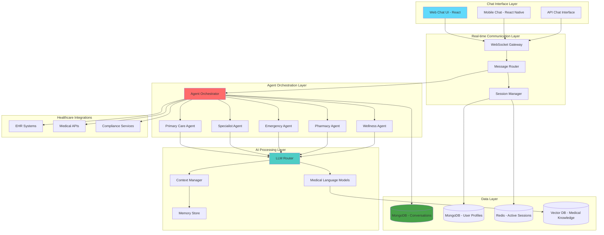

# 💬 IntelliCare Agent-First Chat Architecture

<div align="center">
  
  
  
</div>

---

## 🎯 **Architecture Overview**

IntelliCare employs an **agent-first conversational architecture** where specialized medical AI agents deliver healthcare through intelligent chat interactions, ensuring secure, reliable, and personalized medical conversations at scale.

## 📊 **System Architecture Diagram**



---

## 🏛️ **Architecture Principles**

### 🎯 **Design Philosophy**
- **Conversation First** - Every interaction is a natural medical conversation
- **Agent Intelligence** - Specialized agents for different medical domains
- **Context Awareness** - Agents maintain conversation history and medical context
- **Real-time Chat** - WebSocket-based instant messaging architecture
- **Personalized Experience** - Agents learn and adapt to individual patients

### 🔒 **Security Principles**
- **Zero Trust Architecture** - Verify every request, trust nothing by default
- **Defense in Depth** - Multiple security layers throughout the system
- **Least Privilege Access** - Minimal required permissions for each component
- **Data Encryption** - Encryption at rest and in transit
- **Audit Trail** - Comprehensive logging of all system activities

---

## 🖥️ **Frontend Architecture**

### 📱 **Client Applications**

#### **Chat Application (React)**
- **Framework:** React 18+ with TypeScript
- **Chat UI:** Custom chat components with rich message formatting
- **Real-time:** WebSocket client for instant messaging
- **Message Types:** Text, voice, images, medical documents
- **Agent Avatars:** Visual representation of different medical agents
- **Chat History:** Persistent conversation threads with search

#### **Progressive Web App (PWA)**
- **Service Workers** - Offline functionality and caching
- **Responsive Design** - Mobile-first approach
- **Push Notifications** - Real-time diagnostic alerts
- **Local Storage** - Secure client-side data persistence

### 💬 **Chat UI Architecture**
```
src/
├── components/           # Chat UI components
│   ├── chat/            # Chat interface components
│   ├── agents/          # Agent avatar and presence
│   ├── messages/        # Message types and formatting
│   └── inputs/          # Chat input components
├── agents/              # Agent definitions and logic
├── conversations/       # Conversation management
├── websocket/           # Real-time communication
├── context/             # Chat state management
└── utils/               # Chat utilities
```

---

## 🔗 **Backend Architecture**

### 🌐 **API Gateway & Load Balancing**

#### **Load Balancer (Nginx)**
- **SSL Termination** - Handles HTTPS certificates
- **Request Routing** - Intelligent request distribution
- **Rate Limiting** - DDoS protection and API throttling
- **Health Checks** - Automatic unhealthy instance removal

#### **WebSocket Gateway**
- **Real-time Messaging** - Instant bidirectional communication
- **Agent Routing** - Intelligent routing to specialized agents
- **Message Queue** - Reliable message delivery and ordering
- **Presence Management** - Agent availability and status
- **Session Persistence** - Conversation continuity across connections

### 🔧 **Core Services**

#### **Chat Authentication**
```typescript
Interface: ChatAuthService
├── Chat Session Creation
├── Anonymous Chat Support
├── Registered User Chat
├── Agent Authentication
├── Conversation Encryption
└── Privacy Controls
```

#### **Conversation Management**
```typescript
Interface: ConversationService
├── Chat Thread Management
├── Message History Storage
├── Context Preservation
├── Agent Handoff Logic
├── Conversation Analytics
└── Chat Export/Archive
```

#### **Agent Services**
```typescript
Interface: AgentService
├── Agent Orchestration
├── Intent Recognition
├── Response Generation
├── Context Management
├── Agent Specialization
└── Learning & Adaptation
```

---

## 🤖 **AI Processing Architecture**

### 🤖 **Agent Orchestration Layer**

#### **Agent Management**
- **Agent Registry** - Catalog of specialized medical agents
- **Agent Routing** - Intent-based agent selection
- **Multi-Agent Collaboration** - Agents working together on complex cases
- **Agent Learning** - Continuous improvement from conversations
- **Performance Tracking** - Agent effectiveness metrics

#### **Conversation Flow**
```python
Agent Conversation Flow:
1. Message Reception
2. Intent Classification
3. Agent Selection
4. Context Retrieval
5. Response Generation
6. Medical Validation
7. Message Delivery
8. Conversation Update
```

### 🔬 **Medical AI Models**

#### **Medical Agent Types**
- **Primary Care Agent** - General health consultations
- **Specialist Agents** - Cardiology, neurology, pediatrics, etc.
- **Emergency Triage Agent** - Urgent care assessment
- **Medication Agent** - Drug information and interactions
- **Mental Health Agent** - Psychological support and guidance

#### **Agent Capabilities**
```yaml
Agent Features:
  Conversation:
    - Natural language understanding
    - Medical terminology recognition
    - Empathetic responses
    - Multi-turn dialogue
  
  Medical:
    - Symptom assessment
    - Risk evaluation
    - Treatment suggestions
    - Medication guidance
  
  Personalization:
    - Patient history awareness
    - Preference learning
    - Adaptive communication style
```

---

## 💾 **Data Architecture**

### 🗄️ **Database Design**

#### **MongoDB Collections**
```javascript
Database: intellicare
├── users                 // User accounts and profiles
├── conversations        // Chat threads and messages
├── agents               // Agent configurations
├── contexts             // Conversation contexts
├── intents              // Recognized intents
└── analytics            // Chat analytics and metrics
```

#### **Data Models**
```typescript
// Core Chat Entities
User {
  _id: ObjectId
  name: string
  email: string (encrypted)
  chatPreferences: ChatPreferences
  conversationHistory: ObjectId[]
  createdAt: Date
  lastActive: Date
}

Conversation {
  _id: ObjectId
  userId: ObjectId
  messages: Message[]
  activeAgents: Agent[]
  context: ConversationContext
  status: ConversationStatus
  createdAt: Date
  updatedAt: Date
}

Message {
  _id: ObjectId
  conversationId: ObjectId
  sender: SenderType // User or Agent
  agentId?: ObjectId
  content: string
  attachments?: Attachment[]
  intent?: RecognizedIntent
  medicalContext?: MedicalContext
  timestamp: Date
}
```

### 🔄 **Caching Strategy**

#### **Redis Implementation**
- **Active Chats** - Real-time conversation state
- **Agent Availability** - Online agent status and queue
- **Message Queue** - Reliable message delivery
- **Typing Indicators** - Real-time user activity
- **Conversation Cache** - Recent message history

---

## 🔒 **Security Architecture**

### 🛡️ **Multi-Layer Security**

#### **Network Security**
```yaml
Security Layers:
  1. WAF (Web Application Firewall)
  2. DDoS Protection
  3. SSL/TLS Encryption (TLS 1.3)
  4. VPN Access for Admin Functions
  5. Network Segmentation
```

#### **Application Security**
```yaml
Application Security:
  Authentication:
    - JWT Tokens with short expiration
    - Refresh token rotation
    - Multi-factor authentication
    
  Authorization:
    - Role-based access control (RBAC)
    - Resource-level permissions
    - API endpoint protection
    
  Data Protection:
    - AES-256 encryption at rest
    - TLS 1.3 encryption in transit
    - Field-level encryption for PII
    - Data anonymization for analytics
```

### 📋 **Compliance Framework**

#### **HIPAA Compliance Architecture**
- **Administrative Safeguards** - Security officer, training, access management
- **Physical Safeguards** - Facility controls, workstation security
- **Technical Safeguards** - Access control, audit controls, integrity, transmission security

#### **Data Governance**
```yaml
Data Governance:
  Privacy:
    - Data minimization principles
    - Consent management
    - Right to deletion (GDPR Article 17)
    - Data portability
    
  Security:
    - Regular security assessments
    - Penetration testing
    - Vulnerability scanning
    - Security incident response plan
    
  Compliance:
    - Audit trail maintenance
    - Compliance reporting
    - Risk assessment procedures
    - Business associate agreements
```

---

## ⚡ **Performance Architecture**

### 🚀 **Scalability Design**

#### **Horizontal Scaling**
```yaml
Scaling Strategy:
  Load Balancing:
    - Round-robin distribution
    - Health check monitoring
    - Automatic failover
    
  Microservices:
    - Independent scaling per service
    - Container orchestration (Docker/Kubernetes)
    - Service mesh architecture
    
  Database:
    - MongoDB replica sets
    - Read/write separation
    - Sharding for large datasets
```

#### **Performance Optimization**
- **CDN Integration** - Global content delivery for static assets
- **Image Optimization** - Compressed medical images and documents
- **Code Splitting** - Lazy loading for optimal bundle sizes
- **Database Indexing** - Optimized query performance
- **Connection Pooling** - Efficient database connection management

### 📊 **Monitoring & Observability**

#### **System Monitoring**
```yaml
Monitoring Stack:
  Metrics:
    - Application performance metrics
    - Database performance monitoring
    - AI model performance tracking
    
  Logging:
    - Centralized log aggregation
    - Structured logging (JSON format)
    - Log correlation and searching
    
  Alerting:
    - Real-time alert notifications
    - Threshold-based monitoring
    - Anomaly detection
    
  Tracing:
    - Distributed request tracing
    - Performance bottleneck identification
    - Service dependency mapping
```

---

## 🌐 **Deployment Architecture**

### ☁️ **Cloud Infrastructure**

#### **Multi-Cloud Strategy**
```yaml
Infrastructure:
  Primary Cloud: AWS
    - EC2 instances for application servers
    - RDS for managed database services
    - S3 for file storage
    - CloudFront for CDN
    - Route 53 for DNS management
    
  Backup Cloud: Azure
    - Disaster recovery infrastructure
    - Cross-cloud data replication
    - Failover capabilities
```

#### **Container Orchestration**
```yaml
Kubernetes Deployment:
  Namespaces:
    - production
    - staging  
    - development
  
  Services:
    - Frontend deployment (3 replicas)
    - Backend API deployment (5 replicas)
    - AI microservice deployment (3 replicas)
    - Database deployment (MongoDB cluster)
  
  Configuration:
    - ConfigMaps for environment variables
    - Secrets for sensitive data
    - Persistent volumes for data storage
```

---

## 🔄 **Integration Architecture**

### 🔌 **External Integrations**

#### **Healthcare System APIs**
- **FHIR Compliance** - Fast Healthcare Interoperability Resources
- **HL7 Standards** - Healthcare data exchange standards  
- **Electronic Health Records (EHR)** - Integration with major EHR systems
- **Laboratory Systems** - Direct lab result integration
- **Pharmacy Systems** - Medication verification and interaction checking

#### **Third-Party Services**
```yaml
Integrations:
  AI Services:
    - Hugging Face Model Hub
    - OpenAI GPT models
    - Google Healthcare AI
    
  Healthcare APIs:
    - Drug interaction databases
    - Medical reference APIs
    - Clinical decision support tools
    
  Compliance Services:
    - HIPAA compliance monitoring
    - Audit trail services
    - Data governance platforms
```

---

## 📈 **Future Architecture Considerations**

### 🔮 **Scalability Roadmap**
- **Edge Computing** - Regional AI processing for reduced latency
- **Blockchain Integration** - Immutable medical record management
- **IoT Device Integration** - Real-time patient monitoring data
- **Advanced Analytics** - Machine learning for population health insights

### 🌍 **Global Expansion Architecture**
- **Multi-Region Deployment** - Global infrastructure presence
- **Localization Framework** - Multi-language and cultural adaptation
- **Regulatory Compliance** - Region-specific healthcare regulations
- **Data Residency** - Local data storage requirements compliance

---

<div align="center">
  
  **💬 IntelliCare Architecture - Agent-First Conversational Healthcare**
  
  *Revolutionary medical chat platform where intelligent agents deliver personalized healthcare through natural conversation* 🤖
  
</div>