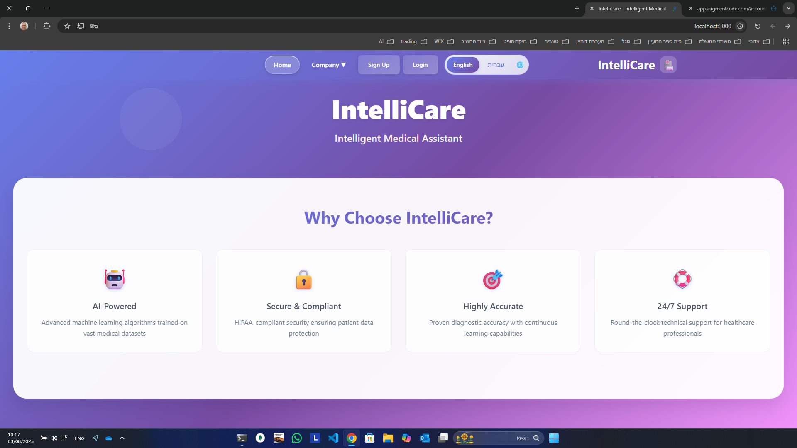
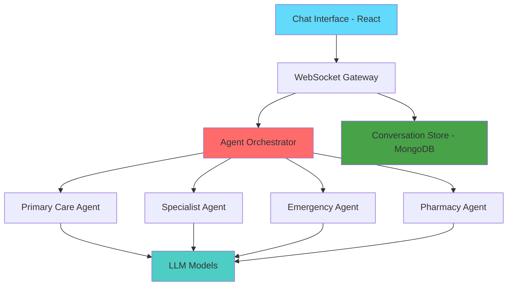

## 📸 **Platform Screenshots**

### 💬 **Agent-First Chat Interface**

  
  
<em>Intelligent medical AI agents providing real-time healthcare assistance</em>

  
  
<em>Multi-agent healthcare platform with specialized medical AI assistants</em>

### 🤖 **AI Medical Chat Experience**

    
  
<em>Conversational AI agents providing instant medical consultations and diagnostic support</em>

  
  <!-- Animated Header -->
  
  
  # 💬 IntelliCare - Agent-First Medical AI Chat Platform
  
  ### 🤖 *Revolutionizing Healthcare Through Intelligent Conversational AI Agents*
  
  <!-- Status Badges -->
  

    
    
    
    
  

  
  <!-- Call to Action -->
  

    
    
  

  
  ---
  
  **🌟 An agent-first medical chat application where intelligent AI agents provide instant healthcare consultations, diagnostic assistance, and personalized medical guidance through natural conversation.**
  
  *Currently in active development - Building the future of medical AI* ⚡
  

## 🚀 **Project Vision**

IntelliCare is pioneering the future of healthcare as an agent-first chat application where patients and healthcare providers interact with specialized medical AI agents. Our conversational AI platform transforms medical consultations into intelligent, accessible, and immediate healthcare experiences.

## ✨ **Key Innovations**

<table>
<tr>
<td width="50%">

### 🧠 **Intelligent Agent System**
- **Multi-Agent Architecture** - Specialized medical AI agents for different healthcare needs
- **Conversational AI** - Natural language understanding for medical consultations
- **Context-Aware Responses** - Agents maintain conversation history and medical context
- **Real-time Chat** - Instant medical guidance through intelligent dialogue

</td>
<td width="50%">

### 🏗️ **Agent-First Architecture**
- **Agent Orchestration** - Intelligent routing to specialized medical agents
- **Chat-First API** - WebSocket-based real-time messaging
- **Secure Conversations** - HIPAA-compliant chat encryption
- **Omnichannel Support** - Chat available across web, mobile, and API

</td>
</tr>
</table>

## 🎯 **Core Capabilities**

### 💬 **Intelligent Medical Agents**
- **🤖 Diagnostic Agent** - Conversational symptom analysis and medical assessment
- **👨‍⚕️ Consultation Agent** - Virtual doctor providing personalized medical advice
- **💊 Medication Agent** - Drug interaction checks and prescription guidance
- **🏥 Triage Agent** - Emergency assessment and care routing through chat

### 🗨️ **Chat-Driven Healthcare**
- **💬 Continuous Conversations** - Persistent chat history with medical context
- **🤝 Agent Handoffs** - Seamless transitions between specialized agents
- **📱 Multi-Channel Chat** - Consistent experience across all platforms
- **🔔 Proactive Health Alerts** - Agents initiate preventive care conversations

## 🏗️ **Technology Stack**

### **Frontend Technologies**

### **Backend Technologies**

### **AI & Machine Learning**

## 🤖 **Medical AI Agents**

IntelliCare's specialized agents powered by state-of-the-art models:

- **💬 Primary Care Agent** - General health consultations and routine care
- **🧠 Specialist Agent** - Deep expertise in specific medical domains
- **🚨 Emergency Agent** - Urgent care assessment and triage
- **💊 Pharmacy Agent** - Medication management and drug information
- **🧘 Wellness Agent** - Preventive care and lifestyle guidance

## 📊 **Platform Architecture**

## 🎯 **Target Applications**

### 👥 **For Patients**
- **24/7 Medical Chat** - Instant access to medical AI agents
- **Symptom Check** - Conversational health assessment
- **Medication Guidance** - Chat with pharmacy agents
- **Health Monitoring** - Proactive wellness conversations

### 🏥 **For Healthcare Providers**
- **Agent-Assisted Consultations** - AI agents support clinical decisions
- **Patient Pre-Screening** - Agents gather initial patient information
- **Follow-up Automation** - Agents handle routine patient check-ins
- **Care Coordination** - Multi-agent collaboration for complex cases

## 🔒 **Security & Compliance**

- **🛡️ HIPAA Ready** - Healthcare data compliance
- **🔐 JWT Authentication** - Secure user sessions
- **🔒 Data Encryption** - End-to-end security
- **📋 Audit Logging** - Complete activity tracking
- **🚫 Privacy First** - Patient data protection

## 🚀 **Development Status**

| Component | Status | Progress |
|-----------|--------|----------|
| 🖥️ Frontend Interface | ✅ Complete |  |
| 🔗 Backend API | ✅ Complete |  |
| 🤖 AI Integration | ✅ Complete |  |
| 🔐 Authentication | ✅ Complete |  |
| 📱 Responsive Design | ✅ Complete |  |
| 🏥 Medical Compliance | 🔄 In Progress |  |
| 📊 Analytics Dashboard | 🔄 In Progress |  |
| 🌐 Multi-language | 📋 Planned |  |

## 💡 **Innovation Highlights**

### 🎯 **What Makes IntelliCare Special**

- **💬 Agent-First Design** - Healthcare delivered through intelligent conversations
- **🤖 Specialized Medical Agents** - Each agent is an expert in its domain
- **⚡ Instant Medical Chat** - No waiting rooms, immediate agent response
- **🧠 Context-Aware Conversations** - Agents remember and learn from interactions
- **🔒 Secure Medical Chat** - End-to-end encrypted healthcare conversations
- **🌐 Always Available** - 24/7 access to medical AI agents

## 📈 **Market Opportunity**

The global medical AI market is projected to reach **$102 billion by 2028**, with diagnostic AI being the fastest-growing segment. IntelliCare positions itself at the forefront of this revolution.

## 🤝 **Collaboration & Investment**

### 🎯 **Seeking Partnerships**
- **Healthcare Institutions** - Pilot program opportunities
- **Technology Partners** - AI model integration
- **Investment Partners** - Scaling and commercialization
- **Research Collaborations** - Academic and clinical partnerships

### 📧 **Get Involved**
Interested in learning more about IntelliCare or exploring partnership opportunities?

**Contact:** [Your Email] | **LinkedIn:** [Your Profile] | **Website:** [Your Website]

---

  
  **🌟 IntelliCare - Your Personal Medical AI Agents, Always Ready to Chat**
  
  
  
  *Transforming healthcare through intelligent conversations, one chat at a time* 💬
  

---

## 📄 **Legal Notice**

This project is currently in active development. All code, algorithms, and intellectual property are proprietary and confidential. 

**© 2024 IntelliCare Platform. All rights reserved.**