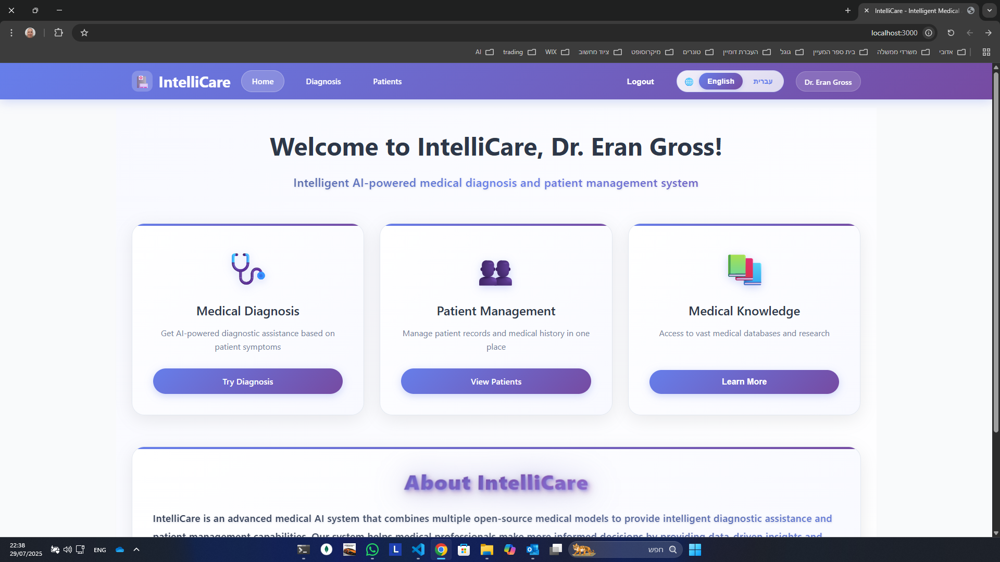
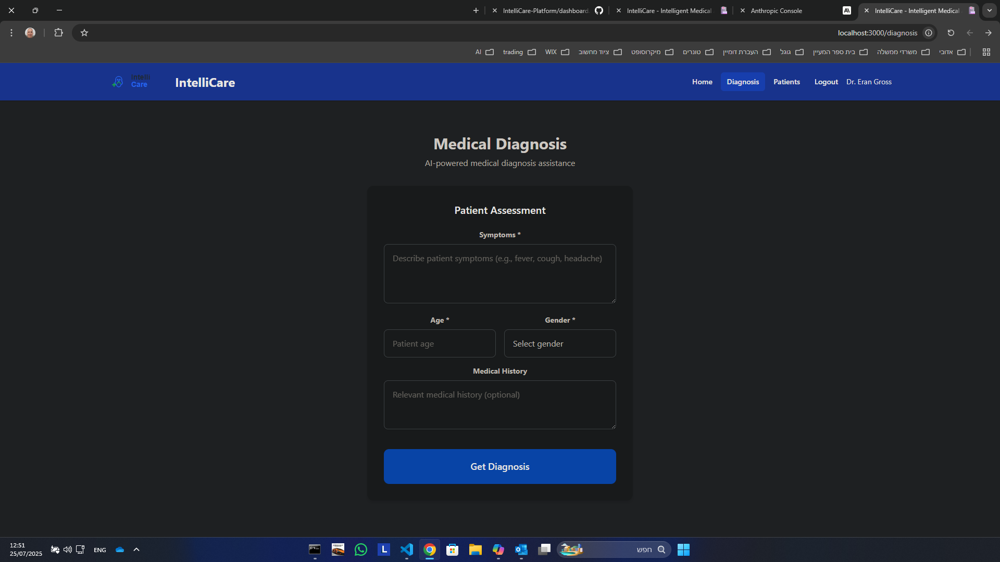
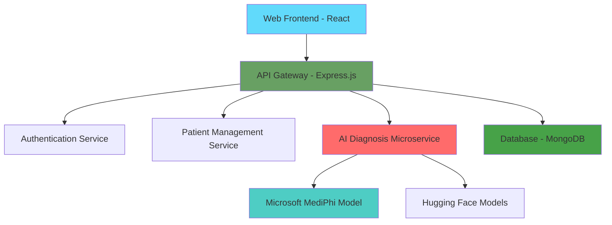

## 📸 **Platform Screenshots**

### 🏠 **Main Dashboard**

  
  
<em>Professional healthcare interface with personalized doctor dashboard</em>

### 🤖 **AI Diagnosis Interface**

    
  
<em>Comprehensive patient assessment with AI-powered diagnostic assistance</em>

  
  <!-- Animated Header -->
  
  
  # 🏥 IntelliCare - Intelligent Medical AI Platform
  
  ### 🤖 *Revolutionizing Healthcare with Advanced AI Diagnostics*
  
  <!-- Status Badges -->
  

    
    
    
    
  

  
  <!-- Call to Action -->
  

    
    
  

  
  ---
  
  **🌟 A cutting-edge medical AI platform that leverages advanced machine learning models to provide intelligent diagnostic assistance, revolutionizing healthcare delivery through artificial intelligence.**
  
  *Currently in active development - Building the future of medical AI* ⚡
  

## 🚀 **Project Vision**

IntelliCare represents the next generation of medical AI platforms, designed to empower healthcare professionals with advanced diagnostic capabilities and intelligent patient management tools.

## ✨ **Key Innovations**

<table>
<tr>
<td width="50%">

### 🧠 **Advanced AI Engine**
- **Multi-Model Integration** - Supports various state-of-the-art medical AI models
- **Microsoft MediPhi Integration** - Leveraging cutting-edge medical language models
- **Confidence Scoring** - Provides reliability metrics for each diagnosis
- **Real-time Processing** - Instant diagnostic suggestions

</td>
<td width="50%">

### 🏗️ **Enterprise Architecture**
- **Microservices Design** - Scalable and maintainable architecture
- **RESTful API** - Modern API-first approach
- **Security First** - HIPAA-compliant data handling
- **Cross-Platform** - Web-based responsive interface

</td>
</tr>
</table>

## 🎯 **Core Capabilities**

### 🏥 **Medical Intelligence**
- **🤖 AI-Powered Diagnostics** - Advanced symptom analysis and diagnostic suggestions
- **📊 Risk Assessment** - Automated patient risk stratification (LOW/MEDIUM/HIGH)
- **💊 Treatment Recommendations** - Evidence-based treatment suggestions
- **📈 Clinical Decision Support** - Data-driven medical insights

### 👨‍⚕️ **Healthcare Management**
- **👤 Patient Management** - Comprehensive patient record system
- **📋 Medical History** - Detailed patient history tracking and analysis
- **🔐 Secure Authentication** - Healthcare-grade security and access control
- **📱 Responsive Design** - Works seamlessly across all devices

## 🏗️ **Technology Stack**

### **Frontend Technologies**

### **Backend Technologies**

### **AI & Machine Learning**

## 🔬 **AI Models Integration**

IntelliCare integrates with multiple state-of-the-art medical AI models:

- **🧠 Microsoft MediPhi** - Advanced medical language understanding
- **⚕️ Meditron-7B** - Open-source medical diagnostics model
- **🌏 DoctorGLM-6B** - Multilingual medical consultation model
- **🔬 BioMistral-7B** - Specialized biomedical language model

## 📊 **Platform Architecture**

## 🎯 **Target Applications**

### 🏥 **Healthcare Institutions**
- **Hospitals** - Emergency diagnostic support
- **Clinics** - Primary care decision assistance
- **Specialist Practices** - Advanced diagnostic insights
- **Telemedicine** - Remote consultation support

### 👨‍⚕️ **Healthcare Professionals**
- **Physicians** - Clinical decision support
- **Nurses** - Patient assessment tools
- **Medical Students** - Educational diagnostic training
- **Researchers** - Medical AI research platform

## 🔒 **Security & Compliance**

- **🛡️ HIPAA Ready** - Healthcare data compliance
- **🔐 JWT Authentication** - Secure user sessions
- **🔒 Data Encryption** - End-to-end security
- **📋 Audit Logging** - Complete activity tracking
- **🚫 Privacy First** - Patient data protection

## 🚀 **Development Status**

| Component | Status | Progress |
|-----------|--------|----------|
| 🖥️ Frontend Interface | ✅ Complete |  |
| 🔗 Backend API | ✅ Complete |  |
| 🤖 AI Integration | ✅ Complete |  |
| 🔐 Authentication | ✅ Complete |  |
| 📱 Responsive Design | ✅ Complete |  |
| 🏥 Medical Compliance | 🔄 In Progress |  |
| 📊 Analytics Dashboard | 🔄 In Progress |  |
| 🌐 Multi-language | 📋 Planned |  |

## 💡 **Innovation Highlights**

### 🎯 **What Makes IntelliCare Special**

- **🚀 First-of-its-kind** - Comprehensive medical AI platform
- **🔬 Multi-model approach** - Leverages best AI models available
- **⚡ Real-time processing** - Instant diagnostic insights
- **🏗️ Scalable architecture** - Enterprise-ready from day one
- **🔒 Security-first** - Built for healthcare compliance
- **🌐 Future-ready** - Designed for continuous AI advancement

## 📈 **Market Opportunity**

The global medical AI market is projected to reach **$102 billion by 2028**, with diagnostic AI being the fastest-growing segment. IntelliCare positions itself at the forefront of this revolution.

## 🤝 **Collaboration & Investment**

### 🎯 **Seeking Partnerships**
- **Healthcare Institutions** - Pilot program opportunities
- **Technology Partners** - AI model integration
- **Investment Partners** - Scaling and commercialization
- **Research Collaborations** - Academic and clinical partnerships

### 📧 **Get Involved**
Interested in learning more about IntelliCare or exploring partnership opportunities?

**Contact:** [Your Email] | **LinkedIn:** [Your Profile] | **Website:** [Your Website]

---

  
  **🌟 IntelliCare - Where AI Meets Healthcare Excellence**
  
  
  
  *Building the future of intelligent healthcare, one diagnosis at a time* 🚀
  

---

## 📄 **Legal Notice**

This project is currently in active development. All code, algorithms, and intellectual property are proprietary and confidential. 

**© 2024 IntelliCare Platform. All rights reserved.**